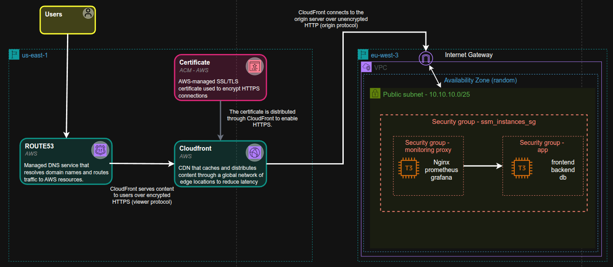
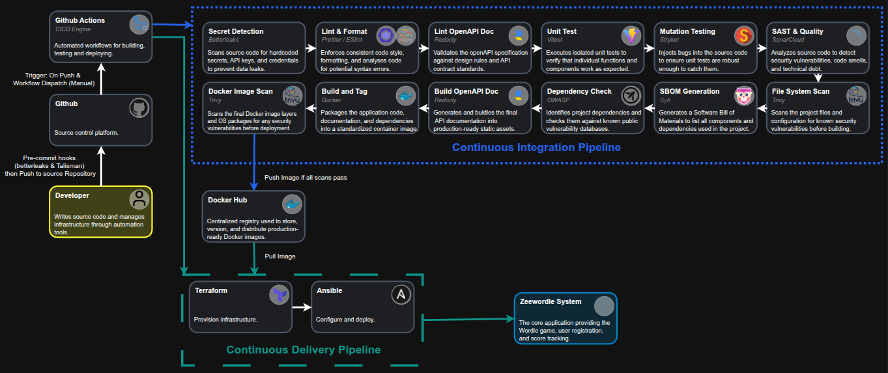

# Zeewordle

🔗 [Live Demo](https://zeewordle.zeeward41.com) _(hosted temporarily — available while job hunting)_  
📄 [My CV / Portfolio](https://zeeward41.com) _(more projects & contact info)_  

**Backend Quality**

**Frontend Quality**

## 🎯 Objective

The objective of this project is to build a full-stack version of the `Wordle` game,
developing the frontend, backend, and the entire DevOps pipeline.
The primary focus areas of this project are **high-quality documentation**,
**thorough unit test coverage**, and the rigorous use of **TypeScript**.

## 🛠️ Stack

**Frontend** : React, Vite, TanStack Router  
**Backend** : Express, TypeScript, Zod, OpenAPI  
**Infra** : AWS (EC2, VPC, CloudFront, SSM), Terraform, Ansible  
**CI/CD** : GitHub Actions, SonarCloud  
**Observability** : Prometheus, Grafana

## 🏗️ Infrastructure Overview
**Network & Compute (AWS)**

**CI/CD Pipeline**

---

## 🗺️ Project Navigation Map

> [!TIP]
> This project follows the **Documentation as Code** methodology. Every technical decision is tracked, and every architectural schema is linked directly to its implementation.

### 💻 Codebase (Applications)

- **[/apps/frontend](./apps/frontend)** : User interface and client-side game logic (React, Vite).
- **[/apps/backend](./apps/backend)** : Core business logic API and authentication (Express, Vite).

### 🏗️ Architecture & Vision (C4 Model)

I use the C4 Model to document the system at different levels of abstraction:

- **[System Context (Level 1)](./docs/architecture/Zeewordle_C4_level_1.png)** : Shows the general architecture and how the application interacts with users and external dependencies.
- **[Container Diagram (Level 2)](./docs/architecture/Zeewordle_C4_level_2.png)** : Details the different containers (applications) that make up the project and how they interact with each other.
- **[Container Diagram CICD (Level 2 Support)](./docs/architecture/Zeewordle_C4_level_2_Support_CICD.png)** : Details the different steps of the CI/CD pipeline.
- **[Infrastructure Showcase Diagram (Level 3 Deployment)](./docs/architecture/Zeewordle_C4_level_3_Infrastructure_Showcase.png)** : Topologie cloud AWS (VPC, Subnets, EC2, Security Groups).

### 🧠 Knowledge Base

- **[Architecture Decision Records (ADR)](./docs/adr/README.md)** : The log of my technical choices. \_Why this tech? ...
- **[Problems Logbook](./docs/problems/LOGBOOK.md)** :
    - The **[LOGBOOK.md](./docs/problems/LOGBOOK.md)** for quick fixes (< 15 min).
    - Dedicated **Post-mortems** inside the folder for complex blockers (> 15 min).
- **[Observability Showcase](./docs/observability/README.md)** : Grafana dashboards demonstrating custom metrics, latency breakdowns, and OAuth dependency monitoring.

---

### 🚀 How to use this documentation?

1. **New to the project?** Start by checking the **[Container Diagram](./docs/architecture/Zeewordle_C4_level_2.png)** to understand the layout.
2. **Wondering about a tech choice?** Consult the **[ADR Index](./docs/adr/README.md)**.
3. **Facing an unknown error?** Check the **[LOGBOOK](./docs/problems/LOGBOOK.md)**.
4. **Curious about the monitoring setup?** See the **[Observability Showcase](./docs/observability/README.md)**.
