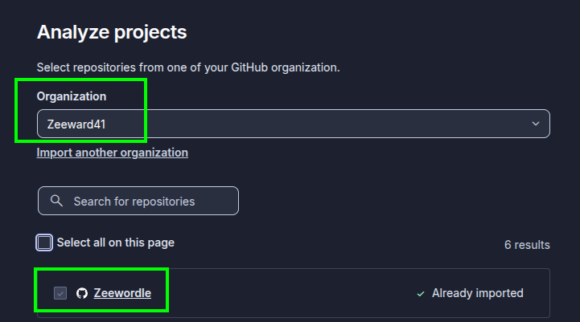
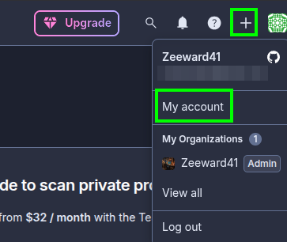

# Configuration of SonarQube Cloud

In this note, we will configure SonarQube Cloud for a monorepo matrix workflow.

## Step 1 - Log into SonarQube Cloud

Go to: `https://sonarcloud.io/login`

## Step 2 - Add a New Project to your organization

1. Click to `Analyze new project`:

2. Select your repository:

## Step 3 - Create a Token

1. Go to `my acount`:

2. Open the `Security` tab.
3. Generate a new Token:

4. Save the Token. ⚠️⚠️ Make sure you copy it now, you won't be able to see it again! ⚠️⚠️

## Step 4 - Add the SonarQube Cloud Token in Github

1. In your GitHub repository, go to `settings` -> `Secrets and variables` -> `actions` -> `New repository secret`

2. Add the `sonarQube Cloud Token` as a secret.

