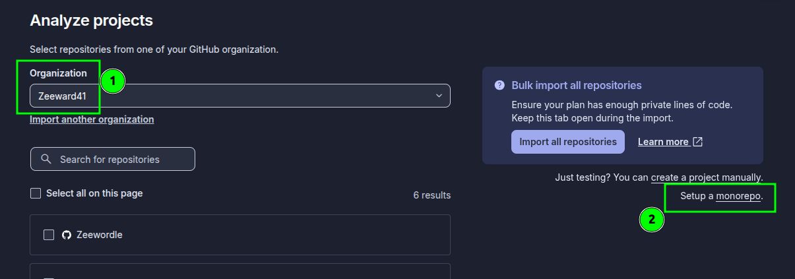
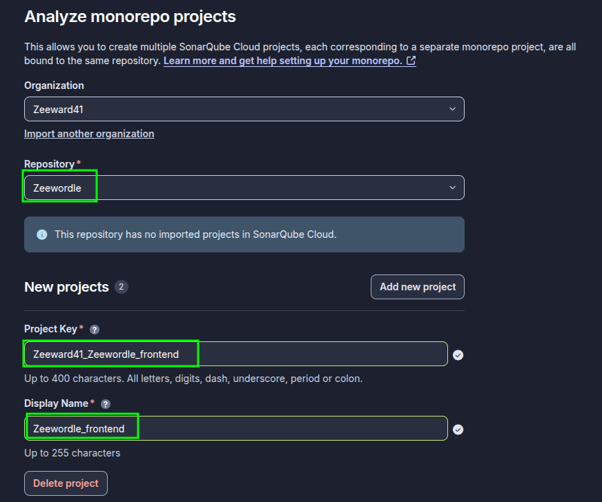
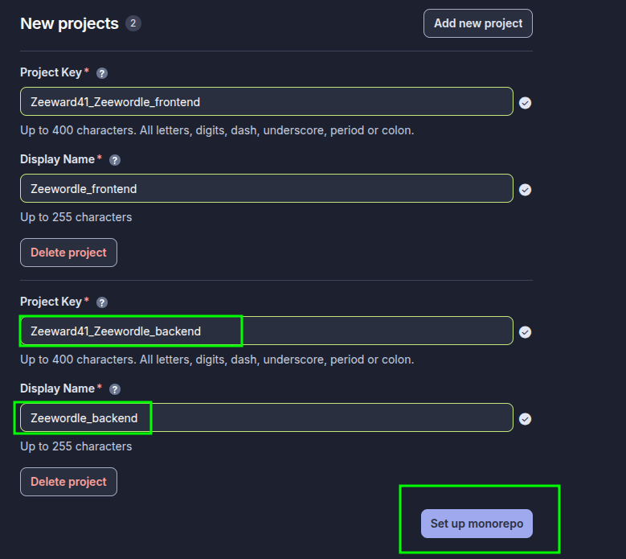
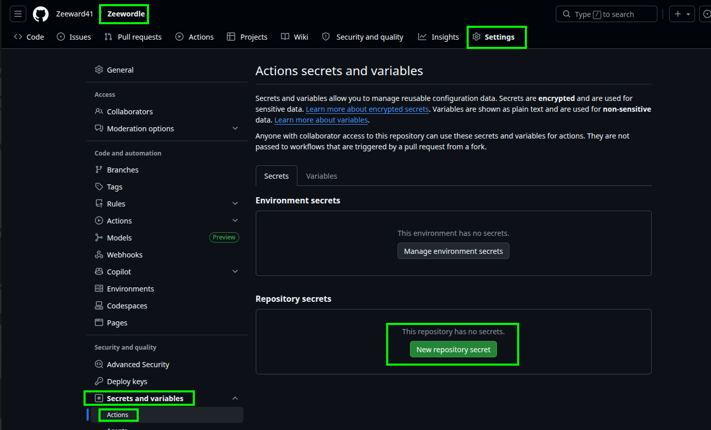
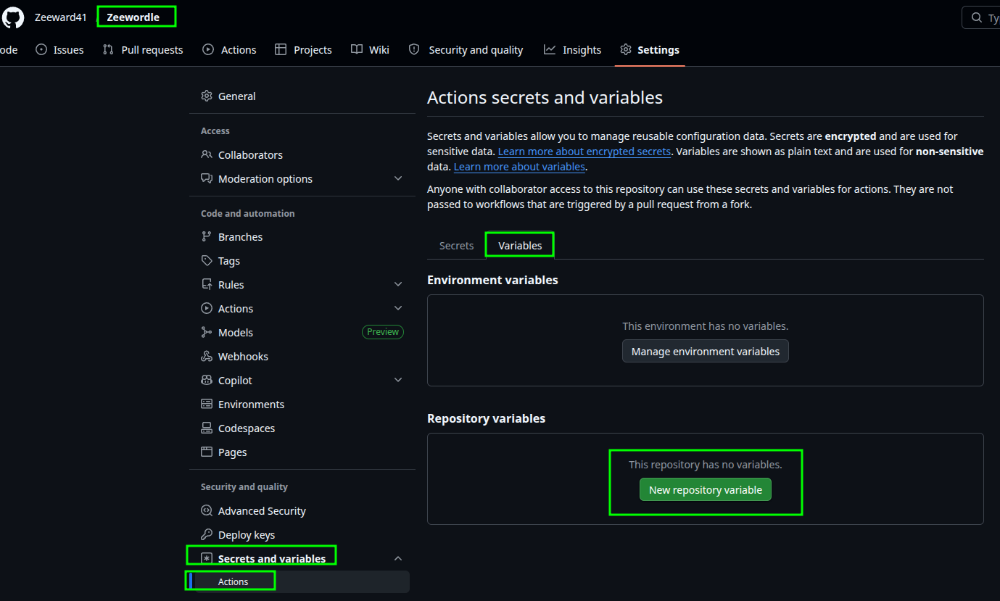
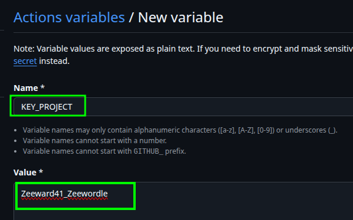

# Configuration of SonarQube Cloud

In this note, we will configure SonarQube Cloud for a monorepo matrix workflow.

## Step 1 - Log into SonarQube Cloud

Go to: `https://sonarcloud.io/login`

## Step 2 - Add a New Project to your organization

1. Click on `Analyze new project`:

2. Select your repository and choose `Setup a monorepo`.

3. Inside the monorepo configuration, you need to declare each application of your project separately by clicking `Add new project`.

⚠️ Crucial Rule: Both projects MUST share the exact same `base prefix` for their Project Key.
Only the suffix (`_frontend` or `_backend`) will change.

### Configure the Frontend Project

- `Project Key`: Enter your preferred key, but it `MUST` end with `_frontend` (e.g., Zeeward41_Zeewordle_frontend).

- `Display Name`: Enter the name you want to see on the dashboard, preferably ending with `-frontend` (e.g., Zeewordle-frontend).

### Configure the Backend Project

Click on `Add new project` again to create the second slot.

`Project Key`: Enter your preferred key, but it `MUST` end with `_backend` (e.g., Zeeward41_Zeewordle_backend).

`Display Name`: Enter your preferred name, preferably ending with `-backend` (e.g., Zeewordle-backend).

⚠️ Important: When saving this Project Key as a GitHub Actions variable in a later step, you MUST NOT include the _frontend or _backend suffixes.
You will only copy the common base prefix (e.g., `Zeeward41_Zeewordle`). The GitHub Actions matrix will automatically append the correct suffix (`_frontend` or `_backend`) during the build execution.

Finally, click on `Set up Monorepo` at the bottom to save your configuration.

## Step 3 - Create a Token

1. Go to `my acount`:

2. Open the `Security` tab.
3. Generate a new Token:

4. Save the Token. ⚠️⚠️ Make sure you copy it now, you won't be able to see it again! ⚠️⚠️

## Step 4 - Add the SonarQube Cloud Token in Github

1. In your GitHub repository, go to `settings` -> `Secrets and variables` -> `actions` -> `New repository secret`

2. Add the `sonarQube Cloud Token` as a secret.

## Step 5 - Add the SonarCloud Project Keys as Variables

1. In your GitHub repository, navigate to `Settings` -> `Secrets and variables` -> `Actions` -> `Variables tab` -> Click on `New repository variable`.

2. Add the **project key**:

- **Name:** `KEY_PROJECT`
- **Value:** Your project key `WITHOUT` the `_frontend` suffix.

💡 **Note:** Remember that the values of these two variables must be exactly identical (without the suffix).

