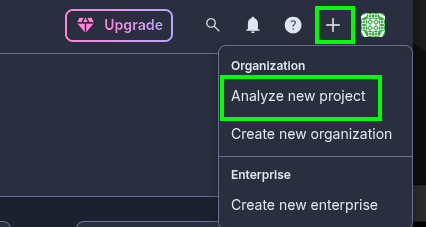
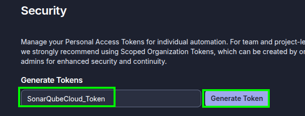
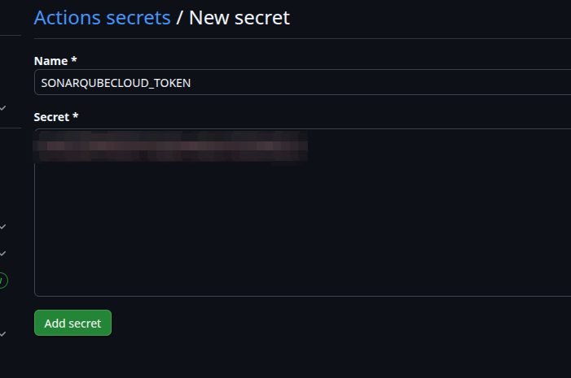
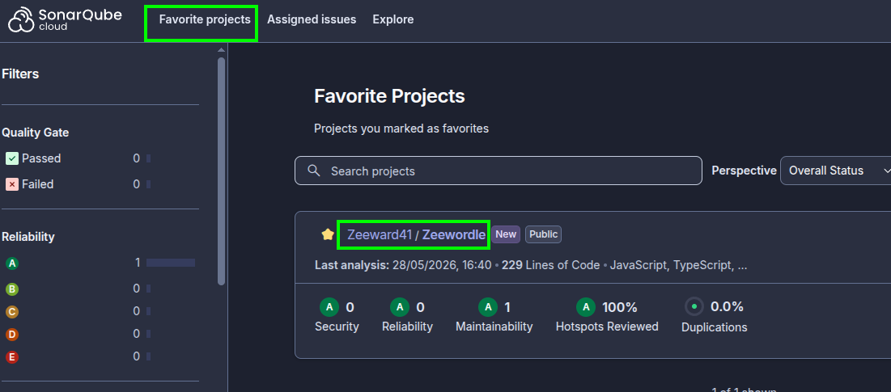
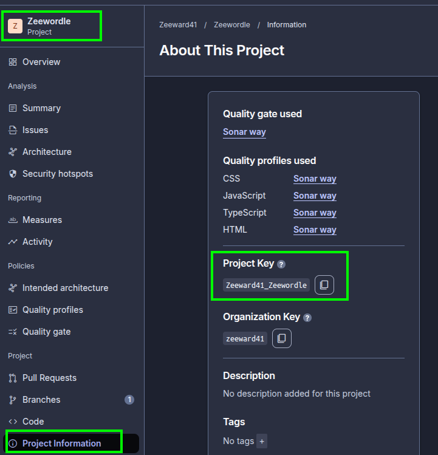

# Configuration of SonarQube Cloud

In this note, we will configure SonarQube Cloud for a monorepo matrix workflow.

## Step 1 - Log into SonarQube Cloud

Go to: `https://sonarcloud.io/login`

## Step 2 - Add a New Project to your organization

1. Click to `Analyze new project`:



2. Select your repository:


## Step 3 - Create a Token

1. Go to `my acount`:


2. Open the `Security` tab.
3. Generate a new Token:



4. Save the Token. ⚠️⚠️ Make sure you copy it now, you won't be able to see it again! ⚠️⚠️

## Step 4 - Add the SonarQube Cloud Token in Github

1. In your GitHub repository, go to `settings` -> `Secrets and variables` -> `actions` -> `New repository secret`


2. Add the `sonarQube Cloud Token` as a secret.



## Step 5 - Workflow Configuration

⚠️ Important:
Do not use a `sonar-project.properties` file at the root level. Since I use a matrix workflow, the configuration must be inlined directly as workflow arguments to prevent path resolution conflicts.

⚠️ Important: Do not write comments (using #) inside the `args block`, as SonarQube will try to parse them as arguments and crash the pipeline.

Add the following step to your GitHub Actions workflow file:
```txt
- name: 🚀 Run SonarQube Analysis
uses: sonarsource/sonarqube-scan-action@v8.1.0
env:
  SONAR_TOKEN: ${{ secrets.SONARQUBECLOUD_TOKEN }}
with:
  projectBaseDir: apps/${{ matrix.changes }}
  args: |
# Defines the unique identifier used by SonarCloud to track this specific application
    -Dsonar.projectKey=Zeeward41_Zeewordle_${{ matrix.changes }}
    -Dsonar.organization=zeeward41
# Sets the display name that will appear on the SonarCloud web dashboard interface
    -Dsonar.projectName=Zeewordle-${{ matrix.changes }}
# The paths to the code and tests
    -Dsonar.sources=src
# We tell SonarQube which files in src are tests
    -Dsonar.tests=src/tests
# We ask SonarQube to ignore these files in the analysis of the main source code
    -Dsonar.exclusions=src/tests/**
# Tell SonarQube where to find the Vitest test coverage report to display the percentage of tested code
    -Dsonar.javascript.lcov.reportPaths=coverage/lcov.inf

```

To find your `project Key`. Go to `Favorite projects` -> `Zeewordle` -> `Project Information`




### Note: Test Coverage

To allow `SonarQube` to display your test coverage percentage, ensuring Vitest generates the `LCOV report` is mandatory. Update your `package.json` scripts:
```txt
"test": "vitest run --coverage.enabled=true --coverage.reporter=lcov"
```

