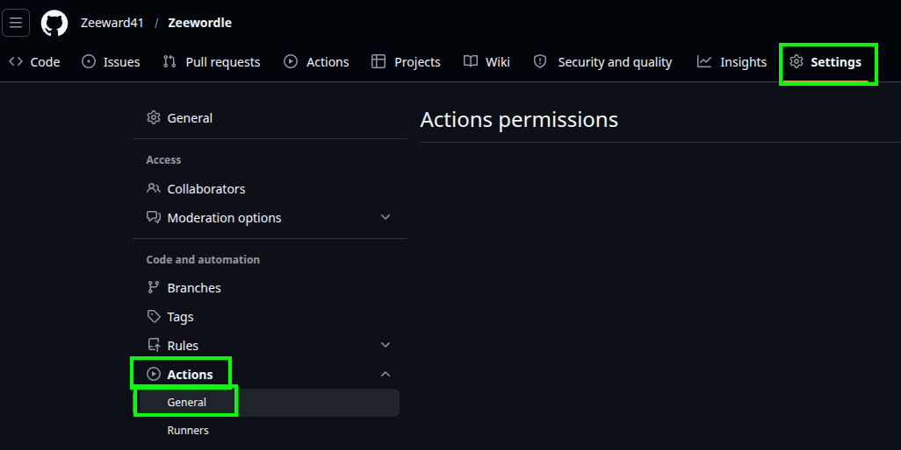
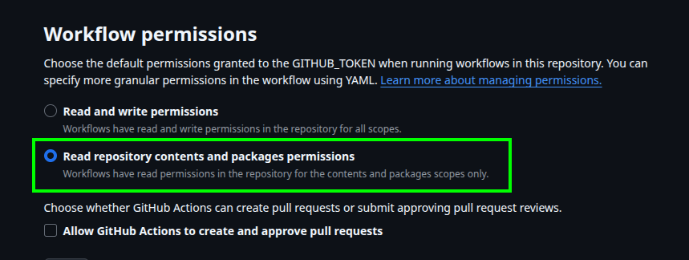
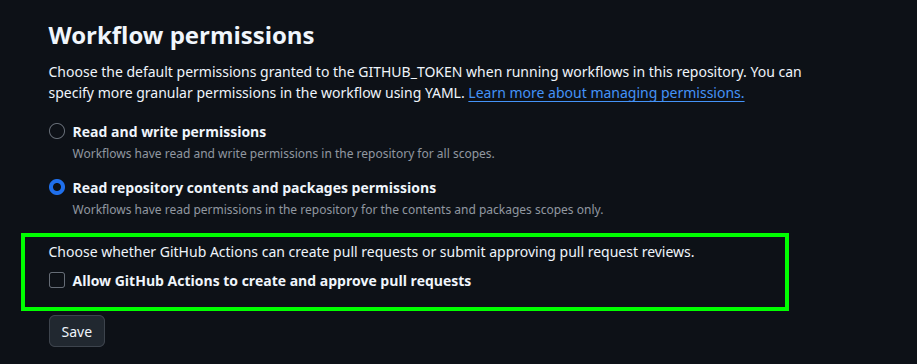

# How to restrict a Github Token ?

Applying the principle of least privilege to your automatic **GITHUB_TOKEN** is critical to secure your repository against malicious dependencies or compromised actions.

1. go to your `Repository` -> `Settings` -> `Actions` -> `General`

2. Scroll down to the Workflow permissions section at the bottom of the page.

3. Select `Read repository contents and packages permissions`.

4. **Crucial Security Step**: Make sure to uncheck the box that says "Allow GitHub Actions to create and approve pull requests". Leaving this checked would allow a compromised workflow to bypass branch protections.

Your automatic pipeline token is now locked down in `Read-Only` restrictive mode!
