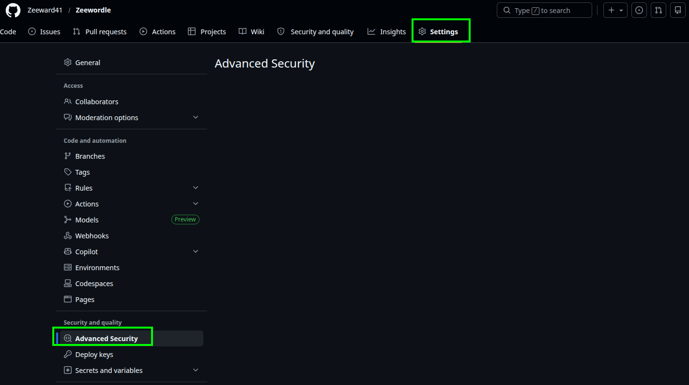
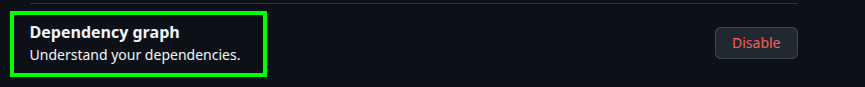
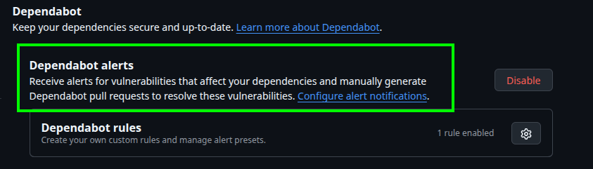
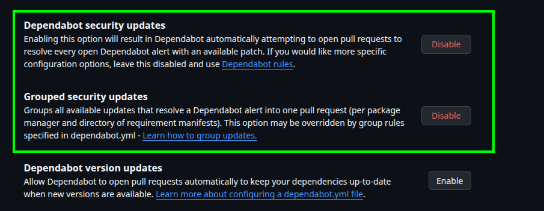

# How to Activate the Dependency Graph and Security Alerts

Some tools in our CI workflow (like Syft SBOM) require GitHub's data features to be active, otherwise the pipeline will fail with a 404 error.

## Step 1 - Go to Advanced Security of your Repository

Go to your **Repository** -> **Settings** -> **Advanced Security**.

## Step 2 - Enable Data Services

Find **Dependency graph** and click **Enable**.

## Step 2 - Enable Security Alerts

On the same page, find **Dependabot alerts** and click **Enable**.

*(This allows GitHub to scan your dependencies in the background and notify you under the "Security" tab if a vulnerability is found).*

## Step 3 - Grouped Security Updates (Optional but Recommended)

1. Enable **Dependabot security updates**.
2. Ensure **Grouped security updates** is checked so GitHub doesn't spam you with 15 different Pull Requests if a major flaw impacts multiple packages.

