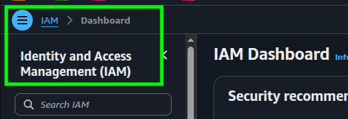
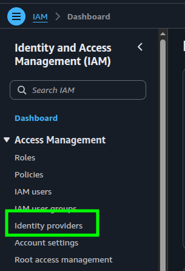
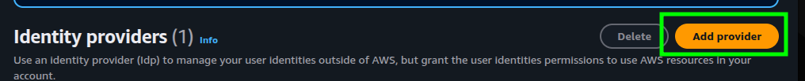
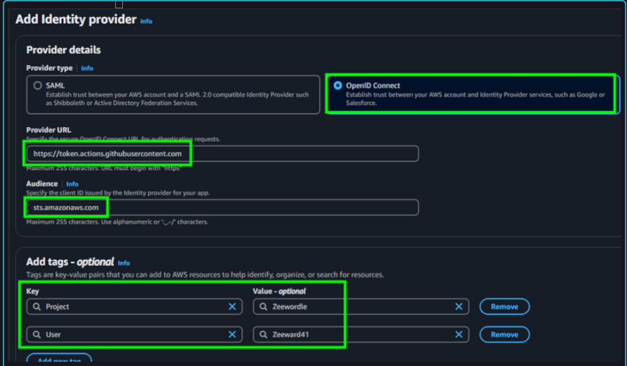
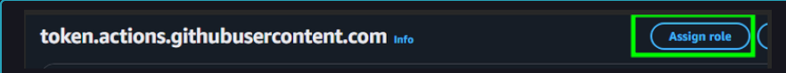
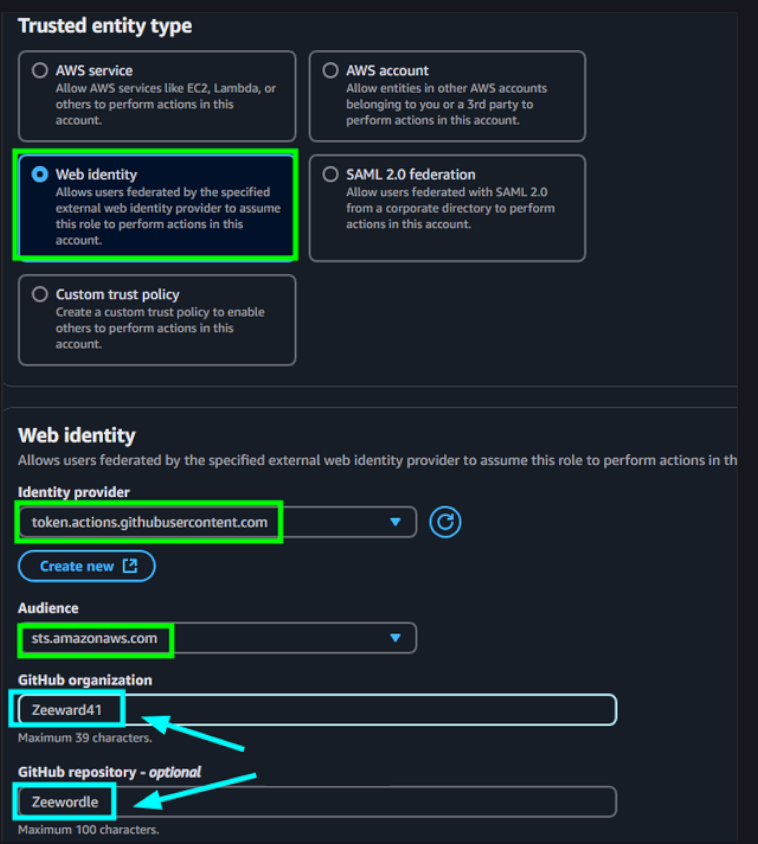

# OIDC Integration: GitHub Actions and AWS

## 1. AWS Configuration

### Step 1: Create the Identity Provider

> **Note:** The GitHub Identity Provider only needs to be created **once per AWS Account**. If you already have one configured for another repository, you can skip this step and reuse it.

1. Navigate to **AWS Console** > **IAM**.


2. In the left navigation menu, click on **Identity providers**.


3. Click **Add provider**.


4. Configure the provider settings:

* **Provider Type:** `OpenID Connect`
* **Provider URL:** `[https://token.actions.githubusercontent.com](https://token.actions.githubusercontent.com)`
* **Audience:** `sts.amazonaws.com`


5. Click **Add provider**.

---

### Step 2: Create the IAM Role and Permissions Policy

1. Go to **Roles** in IAM and click **Create role**.



2. Select **Web identity** as the trusted entity type.
3. Choose the **GitHub** provider (`token.actions.githubusercontent.com`) and select `sts.amazonaws.com` as the Audience.



#### Permissions Policy (Inline / Custom Policy)

Attach a policy defining what resources GitHub Actions is allowed to manage. Following the **Least Privilege Principle**, this policy grants only the minimum required access instead of administrator permissions.

```json
{
  "Version": "2012-10-17",
  "Statement": [
    {
      "Sid": "ParameterStoreAccess",
      "Effect": "Allow",
      "Action": [
        "ssm:GetParameter",
        "ssm:GetParameters",
        "ssm:GetParametersByPath"
      ],
      "Resource": "arn:aws:ssm:*:*:parameter/zeewordle/*"
    },
    {
      "Sid": "EC2ComputeManagement",
      "Effect": "Allow",
      "Action": [
        "ec2:Describe*",
        "ec2:RunInstances",
        "ec2:TerminateInstances",
        "ec2:StartInstances",
        "ec2:StopInstances",
        "ec2:CreateTags",
        "ec2:DeleteTags"
      ],
      "Resource": "*"
    },
    {
      "Sid": "VpcAndNetworkManagement",
      "Effect": "Allow",
      "Action": [
        "ec2:CreateVpc",
        "ec2:DeleteVpc",
        "ec2:ModifyVpcAttribute",
        "ec2:CreateSubnet",
        "ec2:DeleteSubnet",
        "ec2:ModifySubnetAttribute",
        "ec2:CreateInternetGateway",
        "ec2:DeleteInternetGateway",
        "ec2:AttachInternetGateway",
        "ec2:DetachInternetGateway",
        "ec2:CreateRouteTable",
        "ec2:DeleteRouteTable",
        "ec2:CreateRoute",
        "ec2:DeleteRoute",
        "ec2:AssociateRouteTable",
        "ec2:DisassociateRouteTable",
        "ec2:CreateSecurityGroup",
        "ec2:DeleteSecurityGroup",
        "ec2:AuthorizeSecurityGroupIngress",
        "ec2:RevokeSecurityGroupIngress",
        "ec2:AuthorizeSecurityGroupEgress",
        "ec2:RevokeSecurityGroupEgress"
      ],
      "Resource": "*"
    }
  ]
}

```

---

### Step 3: Configure the Trust Policy

The **Trust Policy** defines *who* can assume this IAM Role. Configure the condition block to restrict role assumption strictly to your repository (`Zeeward41/Zeewordle`).

Edit the **Trust relationships** tab of your role with the following configuration:

```json
{
  "Version": "2012-10-17",
  "Statement": [
    {
      "Effect": "Allow",
      "Action": "sts:AssumeRoleWithWebIdentity",
      "Principal": {
        "Federated": "arn:aws:iam::123456789012:oidc-provider/token.actions.githubusercontent.com"
      },
      "Condition": {
        "StringEquals": {
          "token.actions.githubusercontent.com:aud": "sts.amazonaws.com"
        },
        "StringLike": {
          "token.actions.githubusercontent.com:sub": "repo:Zeeward41/Zeewordle:*"
        }
      }
    }
  ]
}

```

Review and validate the role creation.
