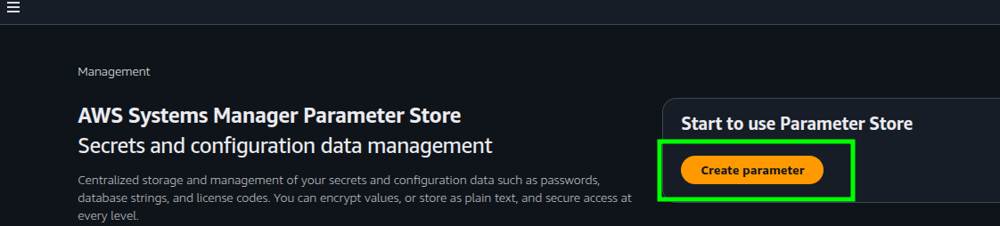
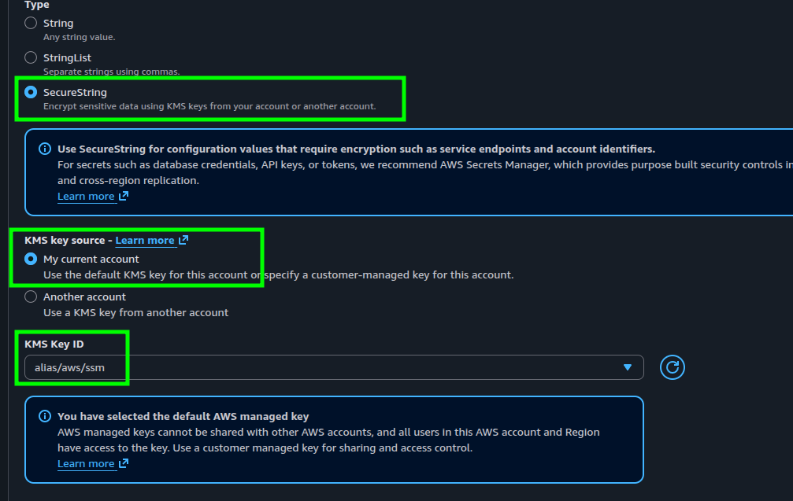
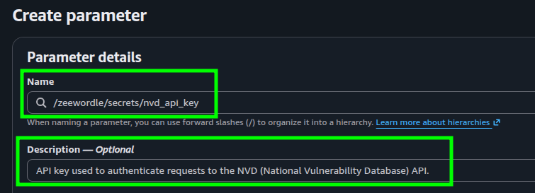

# Setting Up AWS SSM Parameter Store

AWS Systems Manager Parameter Store provides secure, hierarchical storage for configuration data management and secrets management. In this project, it is used to store sensitive variables (e.g., database credentials, API keys) and configuration parameters required by Ansible.

## Step 1: Create a Parameter in AWS Console

1. Navigate to **AWS Console** > **Systems Manager**.
2. In the left menu, under **Application Management**, select **Parameter Store**.
3. Click **Create parameter**.

4. Configure the parameter settings:
* **Name:** Specify a hierarchical path starting with your project prefix (e.g., `/zeewordle/secrets/db_password`).
* **Description:** *(Optional)* A short explanation of what this parameter is used for.
* **Tier:** Select **Standard**.
* **Type:**
* Choose **String** or **StringList** for non-sensitive configuration parameters.
* Choose **SecureString** for sensitive values (passwords, tokens, keys) to encrypt them using AWS KMS.

* **KMS Key Source:** Select `My current account` (uses the default AWS managed key `alias/aws/ssm`).
* **Value:** Enter the actual value/secret.

5. Click **Create parameter**.

---

## Step 2: Naming Convention & Security Scope

To align with the **Least Privilege Policy** configured earlier in the IAM Role, all parameter names **must** start with the `/zeewordle/` prefix.

| Parameter Name Example | Type | Description |
| --- | --- | --- |
| `/zeewordle/config/app_port` | `String` | Application running port |
| `/zeewordle/secrets/db_password` | `SecureString` | Encrypted database password |
| `/zeewordle/secrets/api_token` | `SecureString` | Third-party API access token |

**Security Note:** The IAM policy attached to our GitHub Actions role only permits access to parameters under `arn:aws:ssm:*:*:parameter/zeewordle/*`. Any attempt to read parameters outside this path will be denied.
