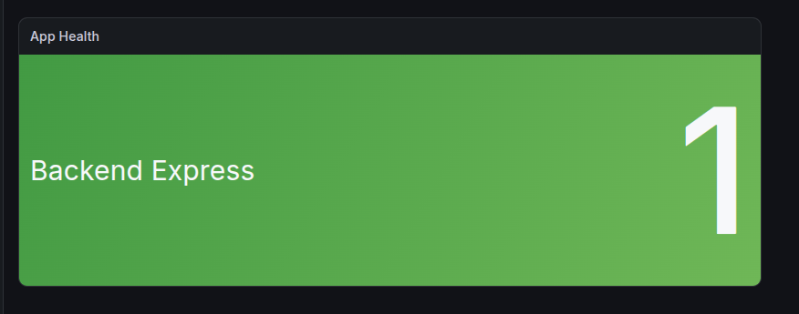
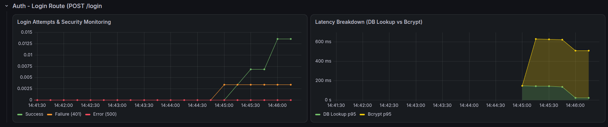
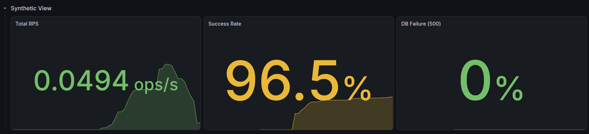
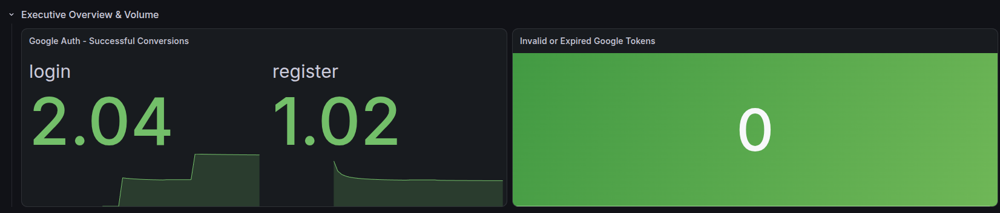
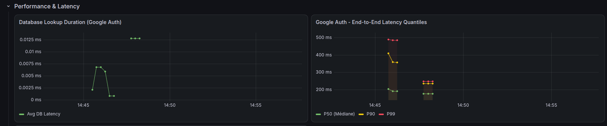
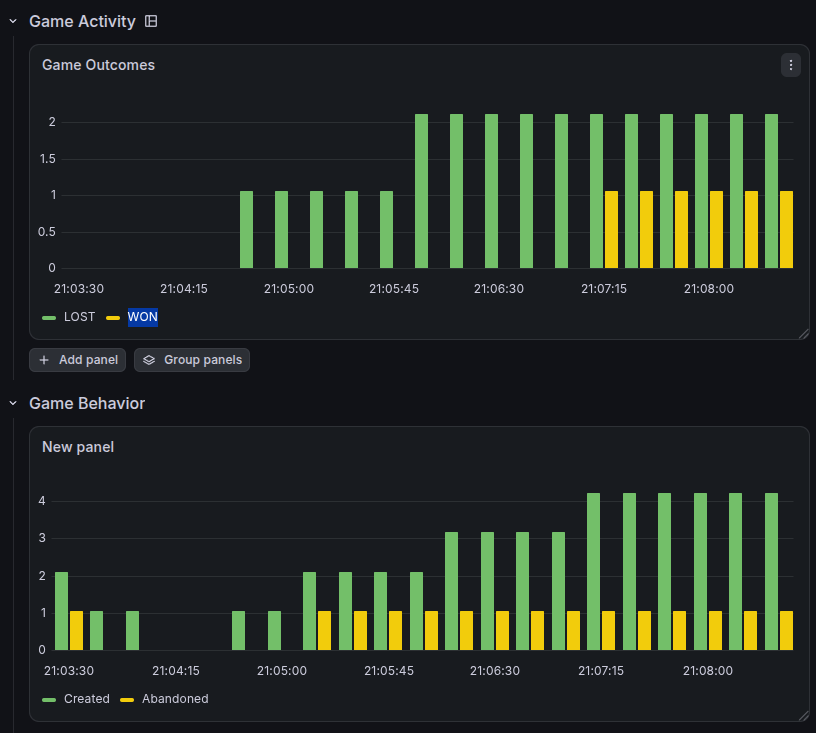

# Observability — Dashboards

Stack: Prometheus + Grafana. Custom application metrics exposed
via `prom-client` on `/metrics` (see [ADR-0016](../adr/0016-Observability-Strategy-for-System-and-Application-Metrics.md)).

## App Health

## Auth — Login

Separates bcrypt (hashing) latency from DB (lookup) latency, 
to isolate the source of slowdowns.

## /me — Synthetic view

Synthetic view: RPS, success rate, DB failures.

## Google OAuth — Executive overview

## Google OAuth — Performance & latency

Monitors the external dependency (Google) separately from 
application latency: DB lookup, end-to-end latency, dependency failures.

## Game API — Behavior

Games created, abandoned, winning attempts.
